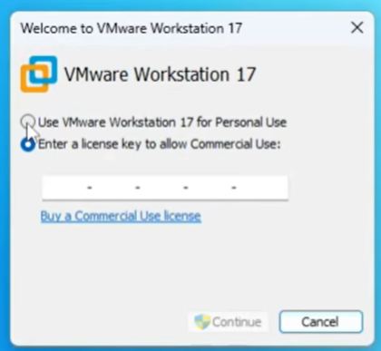
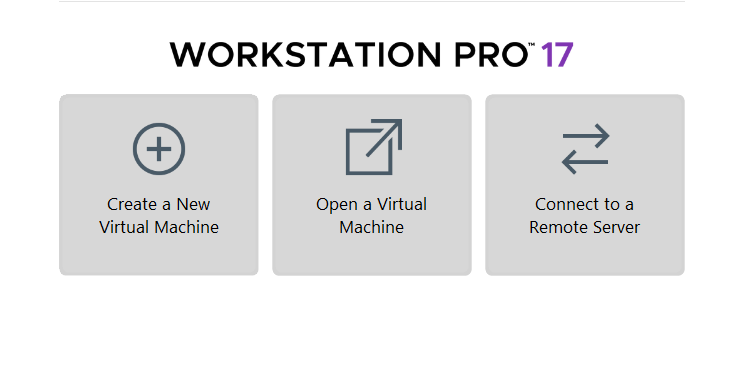
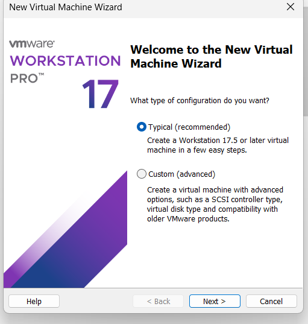
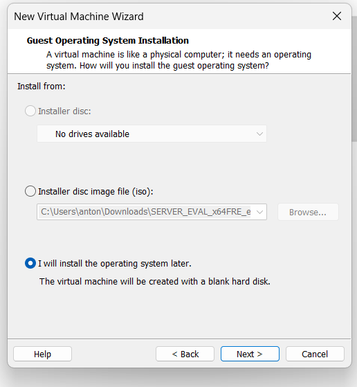
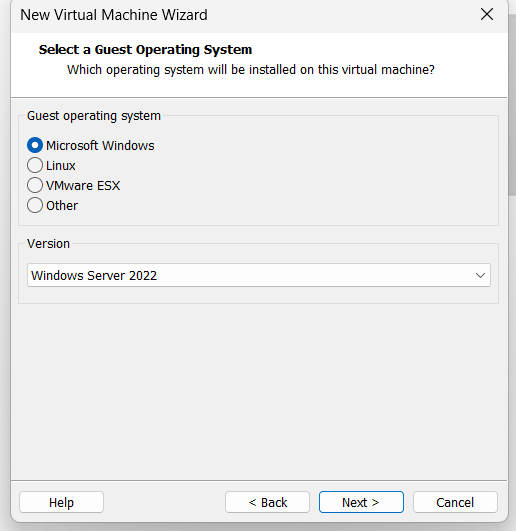
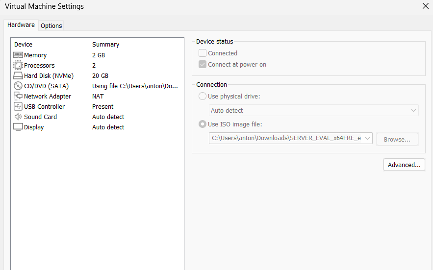
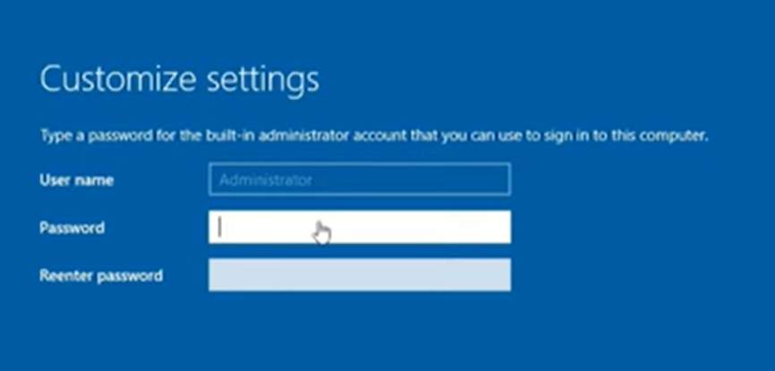
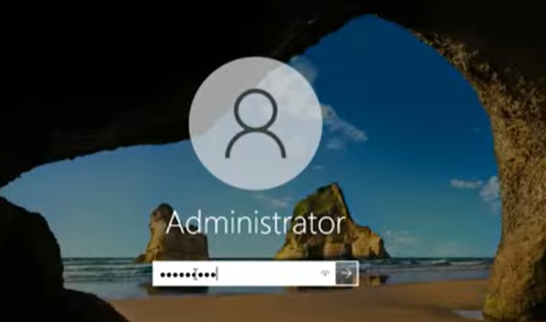

# VMware Workstation: Creating and Configuring a Windows Server 2022 Virtual Machine

This project provides a clear, step-by-step guide for creating a fully functional virtual machine in VMware Workstation Pro and installing Windows Server 2022. 

By following this walkthrough, you will learn how to:

Set up a new virtual machine from scratch

Attach installation media (ISO files)

Configure virtual hardware

Perform a clean installation of Windows Server 2022

Log in and complete initial system setup

## 📌 Prerequisites
Before you begin, ensure you have:

- VMware Workstation installed  
- Windows Server 2022 ISO downloaded  
- At least 8 GB RAM on your host computer  
- 40–60 GB of available disk space  

# 1. Launch VMware Workstation

Open VMware Workstation from your desktop or Start Menu.

### **Screenshot: VMware Workstation 17 Home Screen**

If prompted to choose a license type:

1. Select **Use VMware Workstation 17 for Personal Use**
2. Click **Continue**

### **Screenshot: License Selection**

# 2. Create a New Virtual Machine

1. Click **Create a New Virtual Machine**.

# 3. Select Installation Method

1. Choose **Typical**.
2. Select **I will install the operating system later**.
3. Click **Next**.

# 4. Name the Virtual Machine

1. Name your VM: **Windows Server 2022 Lab**
2. Choose a storage location
3. Click **Next**

# 5. Set Disk Capacity

1. Set disk size to **40–60 GB**
2. Select **Store virtual disk as a single file**
3. Click **Next → Finish**

# 6. Configure VM Hardware

1. Right-click the VM → **Settings**
2. Select **CD/DVD (SATA)**
3. Choose **Use ISO Image File**
4. Select your Windows Server 2022 ISO file

# 8. Start the Installation

1. Click **Power on this virtual machine**
2. Press a key when prompted to boot from the ISO
3. Click **Next → Install Now**

# 9. Select Windows Edition

Choose:

### ✔ **Windows Server 2022 (Desktop Experience)**  
(This is usually the second option.)

# 10. Installation Type

Select:

- **Custom: Install Microsoft Server (advanced)**

Choose the default drive → **Next**

# 11. Create Administrator Password

When prompted:

- Set the Administrator password  
- Click **Finish**

# 12. Log In

Press **Ctrl + Alt + Delete** in the VM window and log in using the Administrator credentials.

## Your Windows Server 2022 VM Is Ready!

You now have a fully installed and functioning virtualized Windows Server environment.

